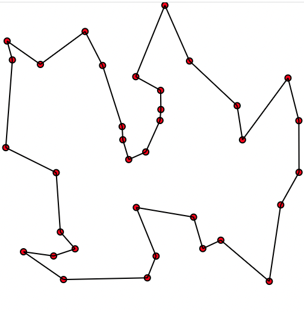

# TSP Java
 Exploration of Travelling Salesman Problem in Java 

Entrypoint for the implmentation is class "Traverse" in package "in.shamit.learn.tsp"

## Approach

This is a naive implementation that tries to evaluate all possible paths.  https://github.com/shamitv/TSP_Java/blob/6aeb5c78f0f3c31054ae162f68bef94bfb0b08aa/src/in/shamit/learn/tsp/Traverse.java#L15 

This amounts to evluation of 350 Trillion possible paths for 17 fully-connecteed vertices. 

## Dataset 

Data is from TSPLIB (http://comopt.ifi.uni-heidelberg.de/software/TSPLIB95/)

Specific example is from a set of Asymmetric traveling salesman problems (ATSP)(http://comopt.ifi.uni-heidelberg.de/software/TSPLIB95/atsp/) 

Dataset link is : http://comopt.ifi.uni-heidelberg.de/software/TSPLIB95/atsp/br17.atsp.gz

##How to run 

This code does not have any dependency beyond a JDK. Open code in any IDE, complie and run.

##Current status 
  
Code finds **100 Million** complete paths every **41 seconds**

022-02-06 19:05:23 INFO in.shamit.learn.tsp.Traverse evaluatePath New Path, Cost = 50
2022-02-06 19:05:23 INFO in.shamit.learn.tsp.Traverse evaluatePath New Path, Cost = 49
50 Path{edges=(0)>==5==>(8) |(8)>==0==>(16) |(16)>==5==>(10) |(10)>==0==>(9) |(9)>==8==>(14) |(14)>==0==>(15) |(15)>==0==>(5) |(5)>==0==>(6) |(6)>==6==>(4) |(4)>==0==>(3) |(3)>==12==>(7) |(7)>==5==>(12) |(12)>==3==>(13) |(13)>==0==>(2) |(2)>==3==>(1) |(1)>==3==>(11) |(11)>==0==>(0) }  
49 Path{edges=(0)>==5==>(8) |(8)>==0==>(16) |(16)>==5==>(10) |(10)>==0==>(9) |(9)>==8==>(14) |(14)>==0==>(15) |(15)>==0==>(5) |(5)>==0==>(6) |(6)>==6==>(4) |(4)>==0==>(3) |(3)>==12==>(7) |(7)>==5==>(12) |(12)>==0==>(1) |(1)>==3==>(13) |(13)>==0==>(2) |(2)>==5==>(11) |(11)>==0==>(0) }  
2022-02-06 19:05:49 INFO in.shamit.learn.tsp.Traverse logProgress 5800000000 Time Elapsed 41 Seconds |  Current Cost + Path  | 343 | Path{edges=(0)>==5==>(16) |(16)>==5==>(1) |(1)>==0==>(10) |(10)>==5==>(8) |(8)>==8==>(14) |(14)>==8==>(7) |(7)>==26==>(2) |(2)>==48==>(15) |(15)>==6==>(3) |(3)>==74==>(13) |(13)>==48==>(5) |(5)>==0==>(6) |(6)>==8==>(12) |(12)>==3==>(11) |(11)>==3==>(9) |(9)>==48==>(4) |(4)>==48==>(0) }  
2022-02-06 19:06:31 INFO in.shamit.learn.tsp.Traverse logProgress 5900000000 Time Elapsed 41 Seconds |  Current Cost + Path  | 181 | Path{edges=(0)>==5==>(2) |(2)>==24==>(16) |(16)>==5==>(10) |(10)>==5==>(8) |(8)>==8==>(14) |(14)>==8==>(12) |(12)>==8==>(15) |(15)>==8==>(1) |(1)>==8==>(6) |(6)>==8==>(11) |(11)>==48==>(3) |(3)>==12==>(7) |(7)>==12==>(4) |(4)>==6==>(5) |(5)>==8==>(9) |(9)>==3==>(13) |(13)>==5==>(0) }  
2022-02-06 19:07:13 INFO in.shamit.learn.tsp.Traverse logProgress 6000000000 Time Elapsed 41 Seconds |  Current Cost + Path  | 247 | Path{edges=(0)>==3==>(10) |(10)>==5==>(16) |(16)>==5==>(11) |(11)>==3==>(9) |(9)>==0==>(12) |(12)>==3==>(13) |(13)>==24==>(8) |(8)>==12==>(4) |(4)>==74==>(2) |(2)>==72==>(3) |(3)>==6==>(6) |(6)>==8==>(1) |(1)>==8==>(15) |(15)>==8==>(7) |(7)>==8==>(5) |(5)>==0==>(14) |(14)>==8==>(0) }  
2022-02-06 19:07:54 INFO in.shamit.learn.tsp.Traverse logProgress 6100000000 Time Elapsed 41 Seconds |  Current Cost + Path  | 251 | Path{edges=(0)>==5==>(16) |(16)>==12==>(4) |(4)>==48==>(10) |(10)>==5==>(8) |(8)>==8==>(15) |(15)>==0==>(5) |(5)>==0==>(6) |(6)>==8==>(7) |(7)>==5==>(11) |(11)>==3==>(9) |(9)>==8==>(14) |(14)>==50==>(2) |(2)>==0==>(13) |(13)>==3==>(12) |(12)>==0==>(1) |(1)>==48==>(3) |(3)>==48==>(0) }  
2022-02-06 19:08:36 INFO in.shamit.learn.tsp.Traverse logProgress 6200000000 Time Elapsed 41 Seconds |  Current Cost + Path  | 227 | Path{edges=(0)>==5==>(8) |(8)>==0==>(16) |(16)>==5==>(10) |(10)>==0==>(9) |(9)>==8==>(15) |(15)>==8==>(12) |(12)>==3==>(11) |(11)>==48==>(4) |(4)>==6==>(5) |(5)>==6==>(3) |(3)>==48==>(1) |(1)>==3==>(13) |(13)>==24==>(7) |(7)>==8==>(14) |(14)>==0==>(6) |(6)>==50==>(2) |(2)>==5==>(0) }  
2022-02-06 19:09:17 INFO in.shamit.learn.tsp.Traverse logProgress 6300000000 Time Elapsed 41 Seconds |  Current Cost + Path  | 198 | Path{edges=(0)>==5==>(16) |(16)>==26==>(2) |(2)>==3==>(10) |(10)>==5==>(8) |(8)>==8==>(15) |(15)>==8==>(1) |(1)>==8==>(6) |(6)>==6==>(3) |(3)>==0==>(4) |(4)>==48==>(9) |(9)>==3==>(13) |(13)>==48==>(5) |(5)>==8==>(7) |(7)>==8==>(14) |(14)>==8==>(11) |(11)>==3==>(12) |(12)>==3==>(0) }

 
## Next steps
Try to find hot spots with JMC and optimize each 
